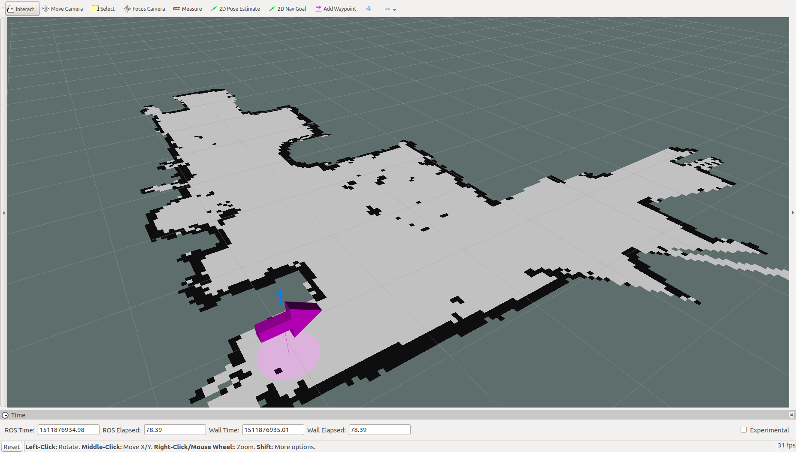

# MapTools工具

## 使用步骤

1. 安装ROS(Humble)
2. 获取源码:
```
cd ~/ros2_ws/src/
git clone https://github.com/6-robot/wp_map_tools.git
```
3. 安装依赖项(根据ROS版本选择其中一个):
```
cd ~/ros2_ws/src/wp_map_tools/scripts/
./install_for_humble.sh
```
4. 编译
```
cd ~/ros2_ws
colcon build --symlink-install
```

## 平台介绍
MapTools工具是[北京六部工坊科技有限公司](http://www.6-robot.com)为旗下WP系列机器人快速设置地图航点所设计的辅助工具,具有操作简单,效果直观的优点。目前支持启智ROS,启智MANI,启程3,启程4和启明1等型号的机器人.


## 操作方法

### 1. 打开地图
仿真:
```
ros2 launch wp_map_tools add_waypoint_sim.launch.py
```


### 2. 设置航点
在Rviz工具栏点击"Add Waypoint"按钮可在地图上设置航点。





### 3. 保存航点
航点设置完毕后,使用如下指令保存航点:
```
ros2 run wp_map_tools wp_saver 
```
